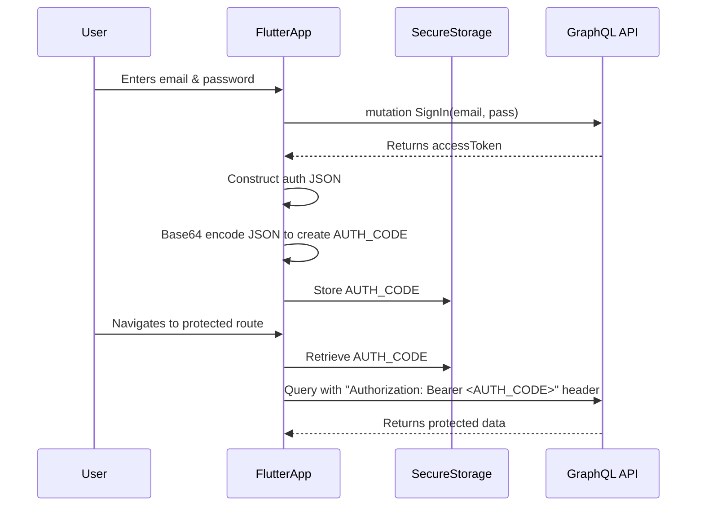

# DESIGN.md: VRone Mobile App

## 1. Overview

This document outlines the design for the VRone Mobile App, a Flutter-based mobile application for the vron.one platform. The app will enable realtors to manage their projects, and for users on supported iOS devices, to scan rooms using the device's LiDAR scanner, process the scan into a 3D model, and upload it to their projects.

The core functionalities are:
- User authentication with the vron.one GraphQL API.
- Viewing and managing real estate projects using the vron.one GraphQL API.. means changing content of projects but not adding new ones and not deleting you can only set it to not active.   
- There is an guest mode where you only can try to scan an room and see the result
- Scanning rooms using the device's LiDAR scanner works by choosing which project to scan. 
- On supported iOS devices, scanning rooms using Apple's RoomPlan framework.
- On-device processing of scanned data into a `.glb` 3D model.
- On-device generation of a navigation mesh (`.glb`) from the model.
- A manual upload feature for `.glb` files (scene and navmesh). and mutate it properly to project using grapqhl mutations

## 2. Detailed Analysis

The project requirements present a few significant technical challenges that will heavily influence the architecture.

### 2.1. Platform-Specific Functionality (LiDAR Scanning)

The requirement to use technology similar to `flutter_roomplan` inherently ties the scanning feature to iOS devices equipped with a LiDAR scanner.

- **Constraint:** The entire scanning and processing workflow will not be available on Android or older iOS devices.
- **Impact:** The UI must be designed to conditionally display scanning features only when the underlying hardware and platform support it. A robust platform and hardware detection mechanism is required.

### 2.2. On-Device 3D Model Processing

This is the most significant technical hurdle. The user has specified that all 3D processing must happen on the mobile device.

- **USDZ to GLB Conversion:** Research indicates there are no standard, off-the-shelf libraries for converting USDZ files (the output of Apple's RoomPlan) to GLB format directly on an iOS device. This conversion is typically handled by server-side tools or desktop applications. Fulfilling this requirement will necessitate a custom solution.
- **Navmesh Generation:** Research shows this is more feasible. Native Swift libraries exist (e.g., `NavMeshBuilder` wrapping the Recast framework) that can generate a navigation mesh from 3D geometry. This would require a native plugin for the Flutter app.

### 2.3. GraphQL API Integration

The app will communicate for development purposes with the `https://api.vron.stage.motorenflug.at/graphql` endpoint.
- **Authentication:** The authentication flow is custom, requiring the creation of a Base64-encoded JWT-like structure to be sent in the `Authorization` header. This logic must be securely handled and the token stored safely on the device.
in detail it is described in the [AUTHENTICATION.md](AUTHENTICATION.md) file
- **Data Models:** The app will need to model GraphQL queries, mutations, and data structures for projects and other relevant entities.

## 3. Alternatives Considered

### 3.1. USDZ to GLB Conversion

*   **Alternative A: On-Device Conversion (User's Preference, High Risk)**
    *   **Approach:** it seems that Apple Model I/O Framework (iOS Native)
    Model I/O (part of iOS/macOS SDK) natively supports reading USD and USDZ, and writing to GLTF/GLB with texture support.
    Can be embedded in a Swift plugin for your Flutter app via platform channels.
    Allows you to convert USDZ → GLTF/GLB, and handle images/textures during conversion.
    *   **Pros:** Fulfills the user requirement for a fully offline, on-device workflow.
    *   **Cons:** Extremely high complexity and risk. 

*   **Alternative B: Server-Side Conversion (Recommended)**
    *   **Approach:** The app uploads the `.usdz` file generated by RoomPlan to a dedicated server endpoint. The server uses industry-standard tools (e.g., Blender, Assimp, or Apple's own `usdzconvert` tool) to perform the conversion and returns a URL to the resulting `.glb` file.
    *   **Pros:** Highly reliable, much lower complexity for the mobile app, and leverages mature, powerful tools. This is the industry-standard approach.
    *   **Cons:** Deviates from the "on-device only" requirement. Requires a network connection and a backend service.

### 3.2. Navmesh Generation

*   **Alternative A: On-Device Generation (User's Preference, Feasible)**
    *   **Approach:** Create a Flutter plugin to bridge to a native Swift library like `NavMeshBuilder`. The Flutter app would pass the geometry data from the GLB file to the native side, which would perform the calculation and return the navmesh geometry.
    *   **Pros:** Fulfills the user requirement. Possible with existing native libraries.
    *   **Cons:** Adds native development complexity. Performance on large models could be slow and memory-intensive, potentially impacting the user experience.

*   **Alternative B: Server-Side Generation**
    *   **Approach:** As with GLB conversion, the scene `.glb` is uploaded, and the server generates the navmesh.
    *   **Pros:** Offloads heavy computation from the device. Simplifies the client application.
    *   **Cons:** Requires a network connection and backend service.

## 4. Detailed Design

This design proceeds with the user's preferred on-device approach but highlights the high-risk components. The architecture will be modular to allow for replacing the on-device processing with a server-based solution if the initial approach proves infeasible.

### 4.1. Architecture

We will use a clean, layered architecture organized by feature.

```
vrone-mobile/
├── lib/
│   ├── main.dart
│   ├── app.dart
│   ├── core/                  # Shared utilities, platform checks, etc.
│   │   ├── platform/
│   │   └── api/
│   ├── features/
│   │   ├── auth/              # Authentication logic and UI
│   │   │   ├── data/
│   │   │   ├── domain/
│   │   │   └── presentation/
│   │   ├── projects/          # Project list and details
│   │   │   ├── data/
│   │   │   ├── domain/
│   │   │   └── presentation/
│   │   └── scanner/           # Scanning and 3D processing
│   │       ├── data/
│   │       ├── domain/
│   │       ├── presentation/
│   │       └── native/        # Bridge to native iOS code
│   └── generated/             # Generated files (e.g., from GraphQL)
└── ios/
    └── Runner/
        └── Navmesh/           # Native Swift code for navmesh generation
```

### 4.2. State Management

We will use `flutter_riverpod` for state management. It provides compile-time safety and is well-suited for managing the different states of network requests, user authentication, and complex on-device processing tasks.

### 4.3. UI/UX Flow

- **Login Screen:** Standard email/password form.
- **Home Screen:** A `BottomNavigationBar` with two tabs: "Projects" and "Profile".
- **Projects Tab:** Displays a list of the user's projects fetched from the GraphQL API. Tapping a project navigates to the detail view.
- **Project Detail View:** Shows project information. A floating action button for "Add Room Scan" will be conditionally displayed here.
- **Conditional UI:** A `PlatformService` in `lib/core/platform` will be responsible for checking `Theme.of(context).platform == TargetPlatform.iOS` and if a LiDAR scanner is available. This service will control the visibility of all scanning-related UI elements.

### 4.4. Key Components and Diagrams

#### Component Diagram
```mermaid
graph TD
    subgraph Flutter App
        A[UI Layer]
        B[State Management (Riverpod)]
        C[Business Logic / Repositories]
        D[Data Sources (API, Secure Storage)]
    end

    subgraph Native iOS
        E[RoomPlan Framework]
        F[Navmesh Generation (Swift)]
        G[USDZ to GLB Bridge (High Risk)]
    end

    H[GraphQL API]

    A --> B
    B --> C
    C --> D
    D --> H
    C -- Scans --> I{Platform Channel}
    I --> E
    I -- Generates Navmesh --> F
    I -- Converts to GLB --> G
```

#### Authentication Flow


### 4.5. Native Integration

A dedicated platform channel, `vron.one/scanner`, will be created to handle all communication between the Flutter app and the native iOS code. It will expose methods like:
- `isSupported()`: Returns true if on iOS with LiDAR.
- `startScan()`: Initiates the RoomPlan scanning UI.
- `processToGlb(usdzPath)`: **(HIGH RISK)** Triggers the on-device conversion.
- `generateNavmesh(glbPath)`: Triggers on-device navmesh generation.

## 5. Summary of Design

The proposed design establishes a solid foundation with a clean architecture and clear separation of concerns. It directly addresses the user's requirements, including the platform-specific scanning feature.

However, the design hinges on the **very high-risk** assumption that an on-device USDZ-to-GLB conversion library can be built or found. This is the most significant risk to the project. The navmesh generation is considered feasible but still requires custom native integration.

**Recommendation:** Proceed with the design, but prioritize creating a proof-of-concept for the native 3D processing (both GLB conversion and navmesh generation) in an early phase of development. If the on-device GLB conversion proves to be a blocker, we must pivot to the server-side alternative.

## 6. References

- [NavMeshBuilder for Swift](https://github.com/vonture/NavMeshBuilder)
- [Flutter Platform Channels](https://docs.flutter.dev/platform-integration/platform-channels)
- [Calling native C/C++ code from Dart](https://flutter.dev/docs/development/platform-integration/c-interop)
- [Stack Overflow: USDZ to GLB/GLTF](https://stackoverflow.com/questions/59828576/how-to-convert-usdz-file-to-gltf-or-glb-in-swift)
